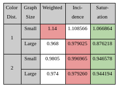

# Solving Graph Coloring Problem with Reinforcement Learning

## Introduction

Graph Coloring Problem (GCP) is an NP-Hard problem, where a color is chosen for each vertex in a way that the total number of colors are minimized and no neighboring vertices have the same color. There are 3 main approaches for solving GCP, but none of them exploit the structure of graphs, since they solve the problem over and over again while only changing the data. 

In this project, we tried to build a reinforcement learning (RL) model, which is an action-reward system which helps machines to learn the given environment and model, in order to solve similar and more complex problems,  to solve GCP by exploitation of graph properties.
In literature, there are papers on using RL for combinatorial optimization like Learning Combinatorial Optimization over Graphs, Neural Combinatorial Optimization with RL etc. in which Travelling Salesman, Minimum Vertex Cover, Maximum Cut problems are tackled. It can be argued that applying RL to NP-Hard problems is a hot topic but our problem -GCP- has not been investigated widely in the literature. There is a related work which has been done in Coloring Big Graphs with AlphaGoZero. However, due to its large computational cost and considering the hardware they use for scaling the algorithm, that approach might not be tractable for especially small systems. On the other hand, the solution we propose focuses more on the graph topology rather than exhaustively searching for possible permutations of colors. Understanding and using graph structure is crucial, because even without proposing a learning algorithm, the coloring sequence formed using node attributes, changes performance significantly.

Our project report can be found under `/Docs/Project Report.pdf`.

## Requirements

- Pytorch v1.5.0
- Numpy 
- Ctypes
- OpenMP
- CPLEX (optional, required for optimal coloring algorithm)

**Notes:** this project is tested on Ubuntu 18.04.

## How To Run

Simply change the directory to `DQNet/` and run `make` command. FOr only training or evaluation, please change the `main.py` file.

## Directories

- **CSV:** All the heuristic based and Double Deep-Q coloring results along with optimal coloring results.

- **Matrices:** All the graphs we have used during our whole project. Only small sized graphs are added to the repository but large sized graphs can be downloaded from the link in the file `notes.txt`.

- **Optimal_Coloring:** Optimal coloring algorithm we have used for small sized graphs. 

- **DQNet:** Double Deep-Q network implementation, graph and vertex ordering heuristics implementations.

## Our Work

In this project, we have worked on distance-1 and distance-2 Graph Coloring Problem on undirected and unweighted graphs. For our coloring algorithm, a greedy approach is preferred that chooses first fitting color to each node. Graphs are colored with respect to the vertex ordering heuristics below:

- Degree-1 Ordering
- Degree-2 Ordering
- Degree-3 Ordering
- Closeness Centrality
- Clustering Coefficient
- PageRank
- Uniform Ordering
- Random Ordering

Based on these heuristics listed above, a weighted model is developed, which assigns weights for each single vertex ordering heuristic and creates a new ordering. However, all these steps were static coloring processes. Therefore, we have also added 2 different dynamic coloring heuristics to our analysis:

- Incidence Degree Ordering (priority on nodes with more number of colored neighbors)
- Saturation Degree Ordering (priority on nodes with more different number of colored neighbors)

By using results of all these heuristics, a Double Deep-Q Network is constructed with 2 fully connected layer structure for each single network. Model is trained on randomly generated graphs and tested on small sized graphs.

## Results & Discussion

As a result of the first part of the project, which includes heuristic analysis and weighted model construction, one can see that the weighted ordering model dominates all the other heuristics, that were used for static greedy coloring, as well as colorings based on uniform and random node selection. If the heuristics’ results are investigated for small size graphs in distance-1 coloring, since the ratio is taken with respect to the optimal coloring results, the improvement is ~4% compared to the best heuristic. For large graphs, improvement is only ~3% and for distance-2 colorings for both sizes, only ~1%. 

If dynamic coloring algorithms are also involved, then better results can be obtained compared to weighted ordering algorithms. Especially with saturation coloring, ~8-10% improvement on distance-1 coloring and ~4% improvement in distance-2 coloring is observed. 

Double Q Network is trained with graphs whose nodes between 100 and 500 and with average degree between 10 and N/4, where N is the number of nodes for a specific graph. We create 10 graphs in each batch and after each coloring operation, the local network is updated with learning rate 0.005. In every 10 epochs we assign the local network’s parameters to the target network’s in order to gain a faster convergence over a total of 120 epochs. Moreover, to accelerate training phase, we check Q-Value’s of top ten nodes with respect to their incidence degree.

As it can be seen from the figure above, that although the Double Q Learning model achieves to perform better than a random coloring, it fails to yield a better result than all other approaches. Since we underestimate the computational requirements of the deep learning model, the amount of time we spend on training may not be sufficient. Conducting further training is left to the future work in order to interpret the success of Double Q Network better.

